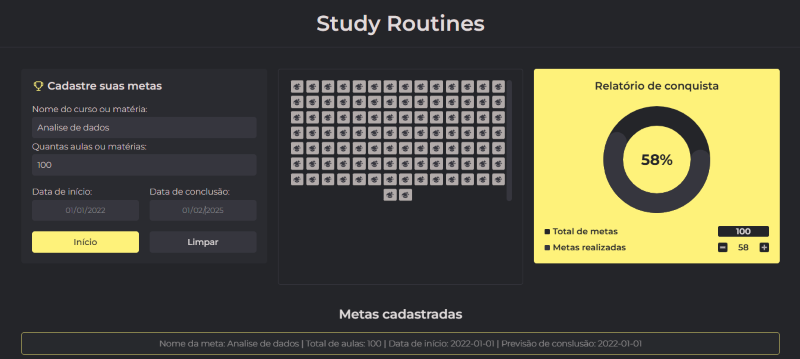

### Aloha! Sou Aryman Reis Dev.Front-End 🤙

#### Projeto Rotinas De Estudos

Projeto desenvolvido exclusivamente por mim, incluindo o ux/ui design e desenvolvimeto web. O mais desafiador foi o gráfico de evolução de acordo com a conclusão das tarefas.

##### Imagem do projeto

#### Clica nesse link e divirta-se 👉 

#### Tecnologias Usadas no projeto

 
  
  
  
  

 

##

#### Contatos:
- Email: arymanreis@gmail.com
- Whatsapp: 21 98642-6569

